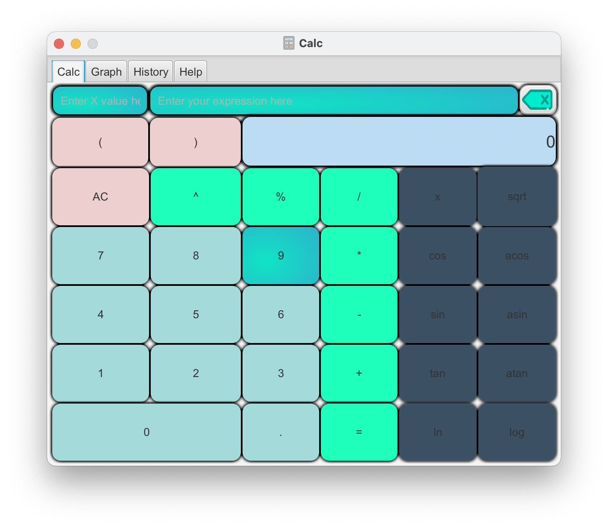
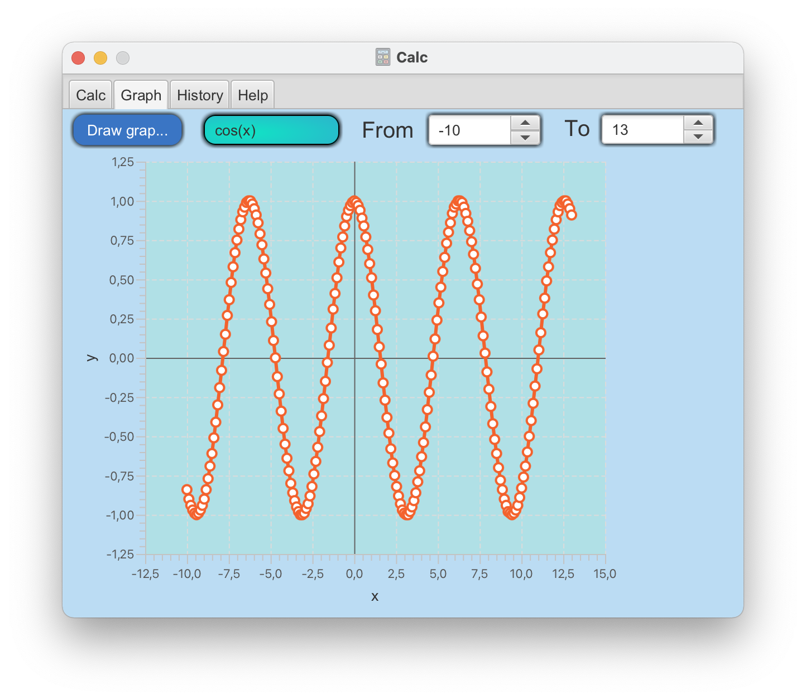
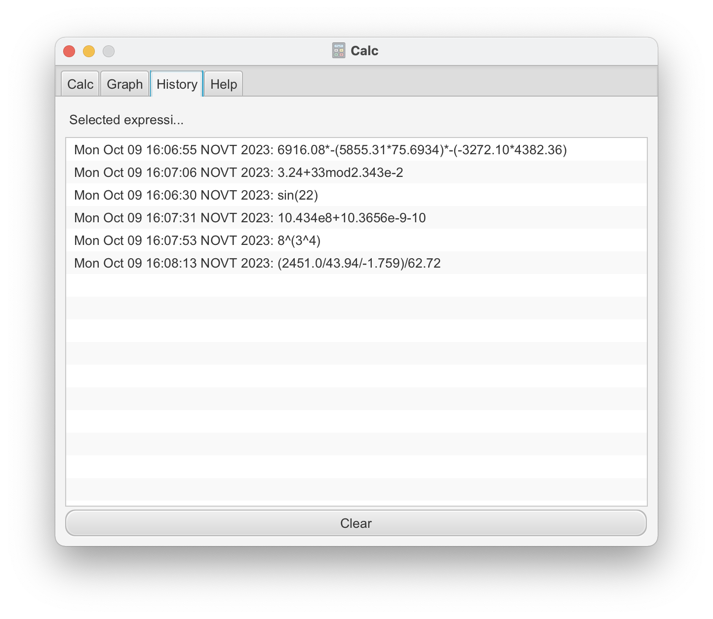
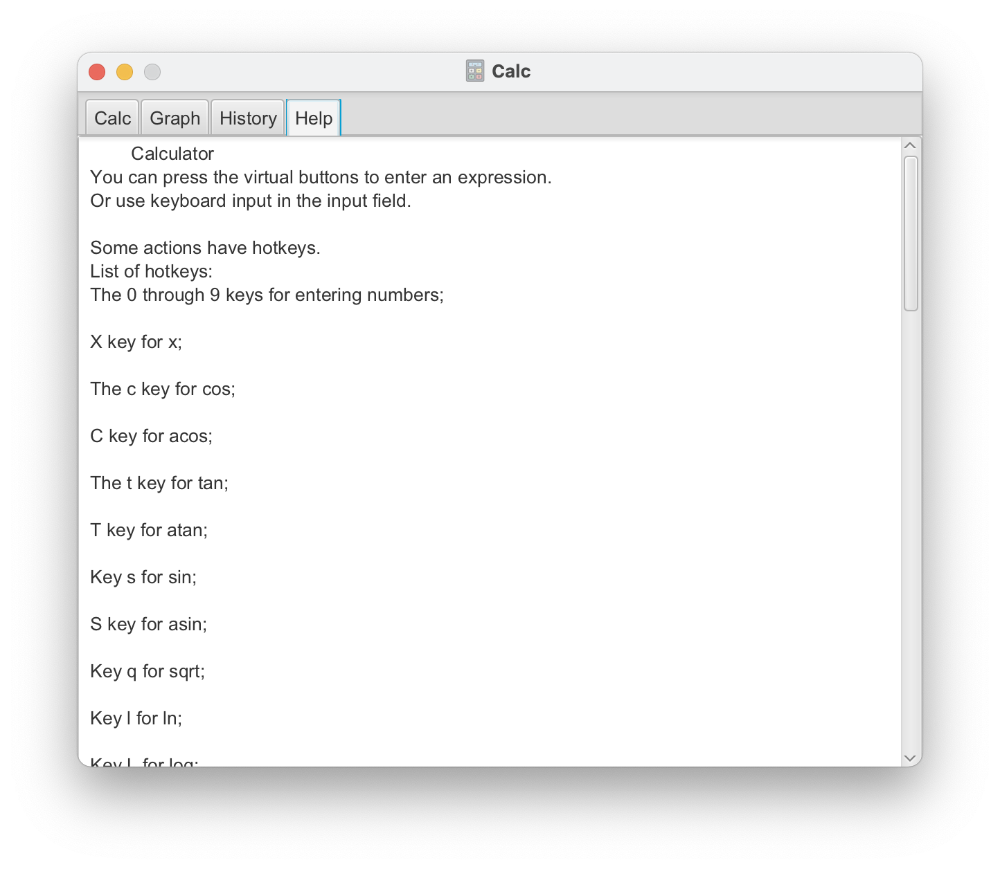

# SmartCalc_v3.1

Добавил альтернативную версию, теперь вычисление выражения происходит через jni(раньше через process builder и аргументы при запуске исполняемого файла + чтение из потока вывода для получения результата), минимально работает под macos, под линукс надо по другому создавать динамическую библиотеку

Собирается через makefile в корне репозитория: make install
Запуск: make open
Удаление: uninstall

